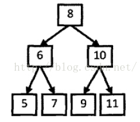

# 问题描述
从上往下打印二叉树的每个节点，同一层的节点按照从左到右的顺序打印。例如输入下图的二叉树，则一次打印出8，6，10，5，7，9，11。



# 基本思路
根据根节点、左孩子、右孩子的顺序依次遍历二叉树，将节点送入队列中。然后依次出队，重复上述操作。
```python
def traverseBinaryTree(head):
    if not head:
        return []
    queue = [head]
    result = []
    while queue:
        node = queue.pop(0)
        result.append(node.val)
        if node.left:
            queue.append(node.left)
        if node.right:
            queue.append(node.right)
    return result
```